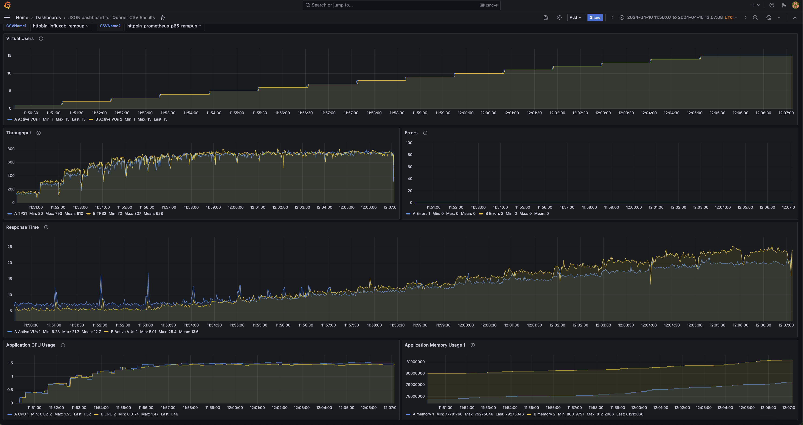

This intends to compare csv results of querier or analyzer input csvs to see their trends

### Run grafana in docker 

```docker run -d --name my-grafana -p 3000:3000 grafana/grafana```

### Login to grafana
any credential, first login with admin:admin to configure the desired password
Change the grafana timezone to UTC

### Install grafana json datasource
Install the datasource json plugin named 'marcusolsson-json-datasource'

### To run debugger in docker/k8s/local

local => 

pip install -r /apps/requirements.txt

python3 debugger.py

docker => 

```
docker build -t debugger .
docker run -d --name mydebugger -p 8080:8080 debugger
```

json-datasource url => http://host.docker.internal:8080/get

k8s => 

Deploy the docker image in k8s as pod and add services to connect via datasource plugin

Example Grafana Json Dashboard =>

